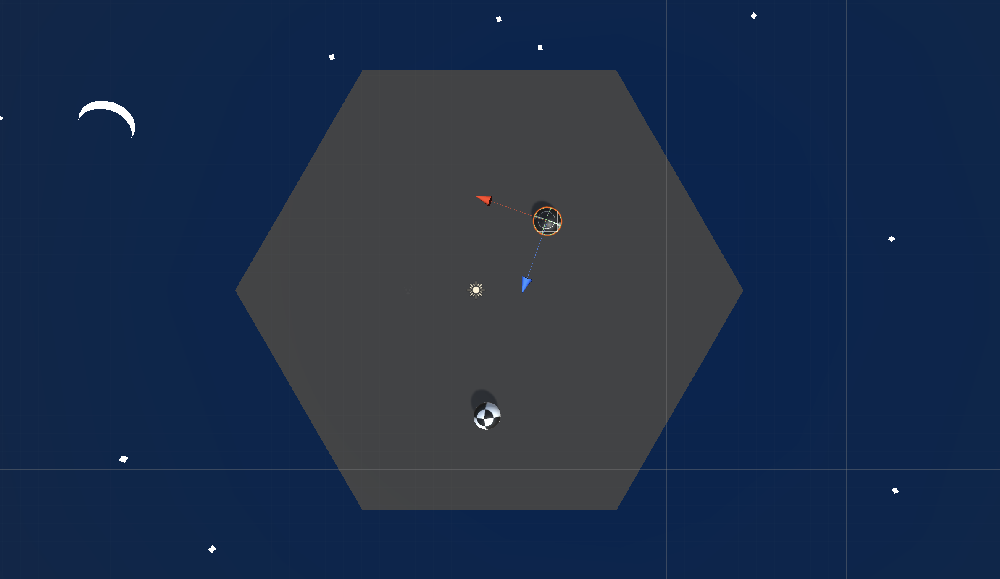

# Overview

In this lesson you'll be adding an opponent who will follow the player and attempt to push them over the edge of the island.

<!-- Don't edit links here, change them in _data/assignment.yml instead, -->

[lesson]: <{{site.data.assignment.lesson}}>     
[slides]:   <{{site.data.assignment.slides}}>   
[template]: <{{site.data.assignment.template}}> 
